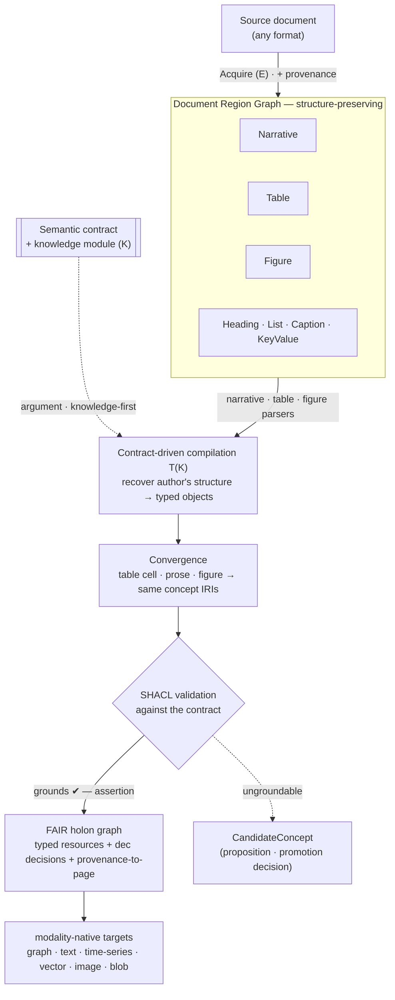

# Architecture

iladub compiles human-addressed documents into FAIR, contract-defined semantic graphs.
It does not extract tables into spreadsheets; it **recovers** an existing, human-addressed
structure and carries its *meaning* forward — never flattening it into tokens at the input
or rows at the output. See [the manifesto](manifesto.md).

## Why not "just extract the tables"

A **tabular report** is a rhetorical act — its caption, units, chosen rows and columns,
footnotes, and the story in the prose around it — not an **array with headers**. Extracting
only the cells lets the destination format (a spreadsheet, a SQL table) dictate what is
captured and discards that context — which is often richer than the table itself. iladub
inverts this: compile the *whole* document into a structure-preserving intermediate, then let
a semantic contract decide what becomes a typed object, from wherever it lives — table cell,
prose, or figure — and load it into a **modality-native** store, never relational-by-default.

## Pipeline

ACQUIRE → compile to a Document Region Graph (DRG) → contract-driven semantic
compilation (narrative / table / figure parsers) → convergence on shared concept IRIs
→ SHACL validation → FAIR semantic graph (typed resources + dec decisions + provenance)

<figure markdown="span">
  <figcaption>Knowledge enters first, as an argument. Each region is parsed with the right
  tool, candidates converge on shared IRIs, and only what SHACL-conforms is asserted — the rest
  is proposed, never faked. The output loads modality-native, never relational-by-default.</figcaption>
</figure>

- **Acquire (E):** fetch/scrape/upload; capture acquisition provenance.
- **Document Region Graph:** each format → typed regions (`Narrative`, `Table`,
  `Figure`, `Heading`, `List`, `Caption`, `KeyValue`) preserving structure, reading
  order, and provenance-to-page. Markdown *renders* narrative regions but is no longer
  the lossy bottleneck — tables keep cell geometry, figures keep pixels.
- **Contract-driven compilation (T(K)):** the semantic data contract declares the
  semantic objects to extract and region rules for where they live. Knowledge enters
  *first* (guiding extraction) and *as an argument* (to the transform).
- **Convergence:** candidates from different regions that resolve to the same concept
  about the same subject merge into one object with multiple evidences.
- **Validate & Load:** SHACL against the contract; only conforming graphs pass.

## The hard parts (honest)

The architecture makes these **composable**, not easy:

- **Density ceiling** — LLMs degrade on long, dense documents. Mitigation is structural:
  segment (DRG) + bound (contract) + parse each region with the right tool. Bounded
  retrieval beats whole-document comprehension.
- **Messy real tables** — pivoted, denormalised, hierarchical headers, scanned. Clean
  digital tables (XLSX, HTML) are deterministic; scans need table-structure recognition
  and will sometimes fail. Emit low-confidence objects with a flag rather than guessing.
- **Multimodal** — charts/images hold facts in no text layer; a figure parser (VLM)
  routes them into the *same* graph. Necessary, not decorative.

## Relationship to standards

- **FHIR**: reuse native machinery — CodeSystem/ValueSet/ConceptMap project to **SKOS**;
  StructureDefinition aligns to **SHACL/ShEx**. The contract's target shapes are these.
- **PROV-O**: extractions/transformations are activities; sources used, outputs generated.
- **SKOS / SHACL / OWL**: the three facets a knowledge module may carry.

## Build order

1. DRG core + XLSX/HTML region backends (deterministic, no OCR).
2. Contract module — `TableRule`, `NarrativeRule`, `FigureRule`, `bind`/`resolveVia`/`derive`.
3. Convergence layer + provenance.
4. PDF region backend (digital first, scanned later).
5. FigureRule + VLM (multimodal).
