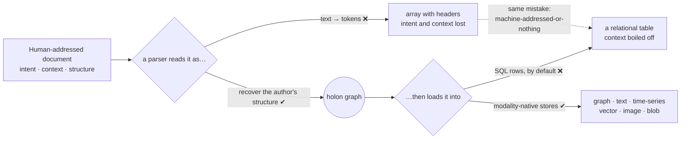

# There is no unstructured data

**A manifesto.**

Structure is not a property data *has* or *lacks*. It is a **relation between data and an
interpreter**. A spreadsheet is "structured" only for an interpreter that already holds the
array-and-dictionary schema. A discharge summary, a contract, a research paper is *exactly
as structured* — for an interpreter that holds the clinical, legal, or scientific competence,
and the language and rhetoric, that the author assumed.

So **"unstructured data" names the wrong thing.** It calls a *missing interpreter* an *absent
structure*. What the industry labels unstructured is simply **human-addressed structure** with
a **latent schema**: fully organised — by genre, argument, layout, implicature, and domain
convention — but addressed to a *person*, not to a machine that understands only arrays and
dictionaries.

> **Every document has structure. Only its interpreter is unbuilt.**

## Two reductions, one mistake

The mistake appears at *both* ends of the usual pipeline:

- **At the input** — a parser reads a document as *text*, then as a *list of tokens*,
  discarding the intent and context the author encoded for a human reader. A **tabular
  report** — with its caption, units, chosen rows and columns, footnotes, and the story in the
  prose around it — is flattened into an **array with headers**. The rhetorical act is boiled
  off; only cells remain.
- **At the output** — the recovered meaning is poured back into a relational table, because
  "structured data" has come to mean "rows a SQL engine can ingest."

<figure markdown="span">
  <figcaption>The two reductions sit at the two ends of the pipeline — tokenise the input,
  flatten the output. Both ❌ branches are the same mistake. iladub takes the ✔ path at each
  end: recover the author's structure, carry it into a holon, load it modality-native.</figcaption>
</figure>

These are the *same* reduction — **machine-addressed-or-nothing** — applied once to the source
and once to the target. Using modern, multimodal AI to keep doing this is **neolegacy**: new
capability spent perpetuating an old flattening. Machines now read more than tables; stores are
polyglot — graph, text, time-series, vector, image, blob. **Thinking SQL-first is not
conservative. It is naïve.**

## What iladub does instead

iladub treats **every source as a fully-structured document whose structure is addressed to a
human**, and refuses to flatten it at either end. Its structure is *complete relative to its
intended interpreter* — recoverable, but not trivially decodable: recovery needs the same
competence the author assumed. So iladub:

1. **Recovers, it does not tokenise.** It reads a document as its author intended, recovering
   the human-addressed structure — which is *why* a **knowledge module** (the reader's
   competence) is supplied **as an argument** of the transform, not bolted on at the end.
2. **Formalises before it migrates.** It makes the document's *own* structure explicit as a
   first-class artifact *before* translating it toward any machine target.
3. **Carries, it does not destroy.** It translates human-addressed structure into a
   **machine-addressed, [modality-native](modality-native-targets.md)** form — a **holon
   graph**, never a row-by-default — losing neither intent nor context.
4. **Stays honest.** It asserts only what it can ground, proposes everything else, and never
   lets a proposition pass as an assertion.

## This is not a metaphor — it is the name

Sumerian *íl* means to lift, to carry, **to bring a value forward** in a ledger — and you can
only carry a value that is *already there*. *dub* is the authored tablet. The
**document-carrier** does not *impose* structure on formless text; it **lifts an existing,
human-addressed structure across the boundary to a machine, and sets it down intact.**

> **There is no unstructured data — only structure we have not yet been willing to read on its
> own terms, and carry forward without flattening.**
