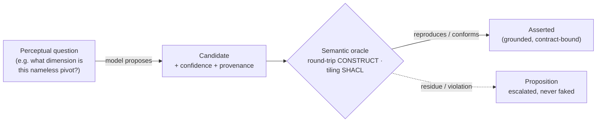

# Neurosymbolic-first

> Reading a human-addressed document is a **neurosymbolic act, not a procedural one**.
> Where meaning can be derived by rule, iladub derives it **declaratively** — a SHACL
> constraint or a SPARQL query over an evidence graph. Where a decision genuinely requires
> perception, a model **proposes** and a **semantic oracle disposes**. A pile of hand-coded
> geometry with a tuned tolerance — the reflex of ordinary parsers — is the failure mode we
> forbid. See [assert vs propose](assertion-proposition.md) and [the manifesto](manifesto.md).

## Why not just write the parser

The neolegacy trap has a second half. The manifesto names the *output* mistake — flattening
the target into SQL rows. The reading half is subtler: recovering the author's structure with
a pile of Python heuristics, each carrying a tuned constant — a whitespace-gutter threshold, a
gap-ratio multiplier, a centering tolerance. Every such constant is a **hidden guess about
what the author meant**, baked into one interpreter and brittle across the next document.

Structure is interpreter-relative. A tuned heuristic freezes one interpreter into procedural
code; the moment the document shifts, the guess is wrong and nothing says so. iladub's edge is
**filling the semantic gap** — naming it, and deriving across it with formal semantics — not
hand-coding geometry around it.

## The gate: earn your Python

Every reading decision is classified **before** any procedural code is written. The default is
semantic; Python must be *earned* and *justified in the code and the spec*.

| Class | When it applies | The form it takes |
|---|---|---|
| **AXIOM** *(default)* | recovery / transform / role / type / boundary decisions | a SHACL rule or a SPARQL `SELECT`/`CONSTRUCT` over an RDF evidence graph — consuming an existing ontology, or filling a **named** gap with thin owned vocabulary |
| **NEURAL** | genuinely perceptual, symbolically underdetermined judgments (*"which columns does this header span?"*) | a model (GenAI, via [BAML](https://boundaryml.com/)) **proposes** under assert/propose/promote, and a **semantic oracle disposes** |
| **PYTHON-OK** | raw extraction (source → typed facts) and decidable exact arithmetic | procedural code that must state **why it is irreducible** to AXIOM or NEURAL |

A **tuned constant or tolerance is prima facie evidence** the decision belongs in AXIOM or
NEURAL, not Python. This is enforced as a hard constraint in every design and review: a tuned
geometric constant, or a Python heuristic answering a span / read / group / role question, is a
review failure unless it is an oracle-disposed proposal or a justified raw-extraction step.

## Propose → oracle → dispose

The NEURAL path is where iladub differs most sharply from an LLM-in-a-loop pipeline. A model's
confidence never asserts anything. The model *proposes* a candidate; a **semantic oracle** — a
formal check, not a threshold — accepts or rejects it.

<figure markdown="span">
  <figcaption>Confidence proposes; the oracle decides. What reproduces the source or conforms
  to the contract is asserted; what does not becomes a
  <a href="assertion-proposition.md">proposition</a> — quarantined and escalated, never
  guessed into the graph.</figcaption>
</figure>

The oracle is the anti-overfit gate: a recovered reading that does not reproduce the document
is **residue, never an assertion**. Credibility over completeness.

## The transform as a declarative artifact

The clearest realization is the **reshape substrate** (shipped 2026-07-15). A tabular report is
an *authored transform* of a flat base — someone pivoted a dimension into the header, added
subtotals, applied cosmetics. iladub recovers the **inverse recipe as data** (a
`tab:ReshapeRecipe` in RDF) and then *executes* it as **fixed SPARQL `CONSTRUCT`s that read
their parameters from that RDF recipe** — in both directions:

- **Inverse** (`grid → base`): a `CONSTRUCT` melts the pivoted header back into a flat base of
  observations. The base is a **derived `hproj:Projection`** — a query result, never a stored
  relational table.
- **Forward** (`base → grid`): `CONSTRUCT`s + SPARQL 1.1 aggregates re-pivot and re-derive the
  subtotals, regenerating the original grid.

The recipe is **certified only if replaying it forward reproduces the original cells exactly**
— a round-trip oracle. The executor is a standard SPARQL engine, not a bespoke Python
interpreter kept in lockstep by hand; there is **no tuned tolerance** anywhere in the
transform. The recipe stops being declarative-looking *data* and becomes an actually-executable
declarative *artifact* — and one that travels: it is portable to any SPARQL engine, and upstream
to a holon substrate's `CONSTRUCT`-at-boundary pattern.

!!! note "Governance, not aspiration"
    The gate is checkable. A dedicated test asserts that no tuned constant lives in the transform
    queries or their executor — the only numeric tolerance in the substrate is the exact-equality
    check in the oracle, which is decidable arithmetic and declared irreducible. "Formal semantic
    code prevails over Python" is thus a property the build enforces, not a slogan.

## Why it matters

- **Portability** — declarative transforms are standard SPARQL/SHACL; they run anywhere, with no
  bespoke runtime to reproduce.
- **Auditability** — the rule *is* the explanation and the oracle *is* the test. A
  [decision](dec.md) is accountable because it was made by a named rule or a disposed proposal,
  not an opaque heuristic.
- **Honesty** — a semantic gap is filled by named vocabulary or **escalated**, never papered
  over by a constant tuned to the document in front of us.

This is the same discipline as [assert-vs-propose](assertion-proposition.md), applied one level
down: to the *code that reads the document*, not just the *facts it emits*.
