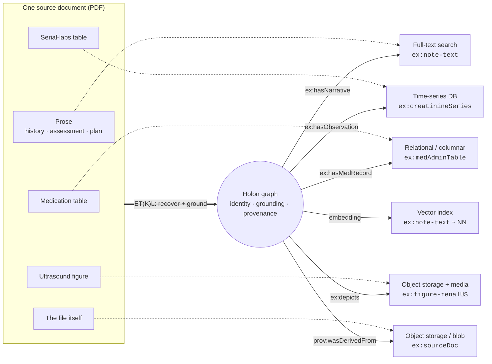

# Use case — one document, many modality-native targets

One clinical encounter note. Not one table extracted into one spreadsheet — **one document
compiled into a holon graph that addresses several modality-native stores**, each holding the
part of the document it can hold faithfully. This is [the manifesto's](manifesto.md) Load half
made concrete: the object's modality chooses the store; the graph is the integration layer.

## The source

A synthetic nephrology follow-up note (a PDF) containing:

- **prose** — history, assessment, and plan;
- a **serial-labs table** — creatinine, eGFR, potassium across several dates;
- a **medication table** — a genuinely rectangular administration record;
- a **figure** — a renal ultrasound image with a caption;
- and the **file itself** — the source PDF.

Ordinary extraction would pick one of these (usually the labs table), flatten it to rows, and
lose the rest. iladub recovers the document's own human-addressed structure and routes each
object to a store that speaks its modality.

## Compile → one holon, many targets



<figure markdown="span">
  <figcaption>One document → one holon → many modality-native stores. Solid edges are the
  graph's IRI references (each with provenance to page); dotted edges show which source region
  feeds which store. The holon is the integration layer; nothing is flattened.</figcaption>
</figure>

Compilation grounds the document against a [semantic contract](etkl.md) into a **holon graph**
(the canonical output), then loads each object into its
[modality-native store](modality-native-targets.md) — every satellite **addressed from the
graph by IRI**, with **provenance to the source page**:

| Object in the document | Modality | Target store kind | Addressed from the graph as |
|---|---|---|---|
| Patient, conditions, meds, findings (grounded, typed) | graph / semantic | RDF triplestore (the holon) | the holon itself — identity + grounding |
| History / assessment / plan narrative | document / text | full-text search store | `ex:note-text` |
| Creatinine · eGFR · potassium over dates | time series | time-series database | `ex:creatinineSeries` |
| Medication administration record (rectangular) | tabular | relational / columnar | `ex:medAdminTable` |
| Renal ultrasound image + caption | image / media | object storage + media service | `ex:figure-renalUS` |
| The source PDF | blob | object storage | `ex:sourceDoc` |
| Embedding of each narrative region | vector | vector index | `ex:note-text` → nearest-neighbour handle |

The graph does not *store* the pixels, the series, or the PDF — it **names** them, records what
they mean, who asserted them, and the page they came from.

*(Illustrative example. Any SNOMED CT / LOINC identifiers shown are for illustration only —
confirm terminology licensing before redistributing real mappings, and keep example documents
synthetic.)*

## What the graph holds (illustrative)

```turtle
@prefix ex:   <https://example.org/ns#> .
@prefix prov: <http://www.w3.org/ns/prov#> .
@prefix dcat: <http://www.w3.org/ns/dcat#> .

ex:encounter-2026-06-01 a ex:ClinicalEncounter ;
    ex:subject          ex:patient-anon-01 ;
    ex:hasNarrative     ex:note-text ;          # → search store
    ex:hasObservation   ex:creatinineSeries ;   # → time-series store
    ex:hasMedRecord     ex:medAdminTable ;       # → relational store
    ex:depicts          ex:figure-renalUS ;      # → object storage + media
    prov:wasDerivedFrom ex:sourceDoc .           # → object storage (blob)

ex:creatinineSeries a ex:TimeSeries ;
    ex:loinc            "2160-0" ;               # illustrative
    dcat:accessURL      <tsdb://renal/creatinine/anon-01> ;
    prov:wasDerivedFrom ex:region-p2-table1 .    # provenance: page 2, table 1

ex:figure-renalUS a ex:MediaObject ;
    dcat:accessURL      <s3://media/anon-01/renalUS.png> ;
    prov:wasDerivedFrom ex:region-p3-fig1 .      # provenance: page 3, figure 1
```

Each satellite carries a `dcat:accessURL` to its modality-native store and `prov:wasDerivedFrom`
back to the exact region of the source. **The identifiers are the integration.**

## The payoff

A single traversal that starts at `ex:patient-anon-01` can reach:

- the **grounded facts** (in the graph),
- the **narrative** (a search store) — *"what did the clinician actually say?"*,
- the **creatinine trend** (a time-series store) — *"is renal function worsening?"*,
- the **ultrasound image** (object storage) — *"show me the finding"*,
- and **similar notes** (a vector index) — *"find comparable cases"*,

…each answered by the store that speaks that modality, all tied together by the graph, none of
it flattened — and **portable**, because the canonical form is open (RDF / JSON-LD / SHACL /
PROV-O). No engine is load-bearing; swap any satellite and the holon still holds.

> One document did not become one table. It became a **holon that knows where every part of
> itself lives, what it means, and where it came from.**

See also: [the manifesto](manifesto.md) · [modality-native targets](modality-native-targets.md)
· [architecture](architecture.md).
